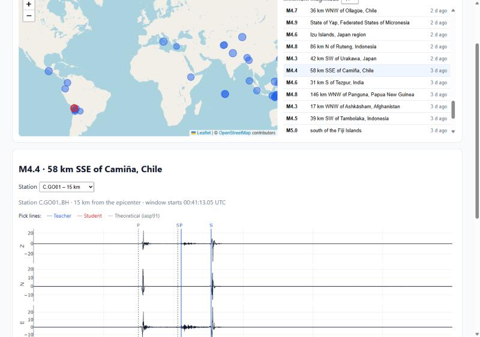

# EQT-Live: Real-Time Earthquake Detection with a Distilled Model

[](https://github.com/orshterenshus/eqt-live/actions/workflows/ci.yml)

**Live demo:** https://eqt-live-6nkkumst7q-uc.a.run.app



EQT-Live runs two deep-learning models side by side on **real seismic recordings**:

- **Teacher:** the original [EQTransformer](https://github.com/smousavi05/EQTransformer) (373K parameters)
- **Student:** a 61K-parameter model I compressed from it with **knowledge distillation**
  in my B.Sc. final project (6.2x fewer parameters). It is ~7x faster on GPU in the thesis
  benchmarks; on CPU (this demo) the difference is smaller, so the app shows the measured
  per-window latency for both models.

Pick a recent earthquake on the map, choose a nearby station, and see where each model
detects the P and S waves, compared with the theoretical arrival times and each model's
inference latency.

## How it works

1. Recent earthquakes come from the **USGS** catalog.
2. For the chosen earthquake, nearby 3-component stations and 2 minutes of waveform data
   are downloaded from **EarthScope (IRIS) FDSN** services with ObsPy.
3. Channels 1/2 are rotated to N/E using station metadata, and the signal gets an
   EQTransformer-style 1-45 Hz bandpass, is resampled to 100 Hz, cut into overlapping
   60-second windows and standardized, as during training.
4. Both models run on the same windows; their probability curves are stitched and turned
   into P/S picks.
5. Theoretical arrivals are computed with the iasp91 Earth model (ObsPy TauP).

## Architecture

```
React + TypeScript (Vite)  ──►  FastAPI
                                 ├── main.py        app, routes, health
                                 ├── service.py     orchestrates an analysis request
                                 ├── events.py      USGS client
                                 ├── stations.py    FDSN client, station selection, rotation, TauP
                                 ├── preprocess.py  filtering, resampling, windowing, normalization
                                 ├── models.py      TensorFlow inference (teacher + student)
                                 ├── picks.py       curves → detections and P/S picks
                                 └── cache.py       TTL cache
One Docker image · GitHub Actions CI/CD · deployed to Google Cloud Run (keyless auth via Workload Identity Federation)
```

Tested with 87 backend tests (pytest, no network access) and 11 frontend tests (Vitest).

## Tech stack

Python · FastAPI · Pydantic · TensorFlow/Keras · ObsPy · NumPy/SciPy · pytest ·
React · TypeScript · TanStack Query · Plotly · Leaflet · Vitest · Docker · GitHub Actions · Google Cloud Run

## Run locally

```bash
docker compose up --build
# open http://localhost:7860
```

Development:

```bash
cd backend && python -m venv .venv
source .venv/bin/activate          # Linux/macOS
# source .venv/Scripts/activate    # Windows (Git Bash); PowerShell: .venv\Scripts\Activate.ps1
pip install -r requirements-dev.txt && pytest
uvicorn app.main:app --port 8000

cd frontend && npm install && npm run dev   # http://localhost:5173
```

API docs: `/docs` (OpenAPI, generated by FastAPI).

## Known behavior & limitations

- On quiet live noise the teacher often flags a detection while the student is more
  conservative. This is observed behavior; detection thresholds were not tuned.
- Stations are limited to about 330 km from the epicenter, because the models were trained
  on local events (STEAD).
- Picks use the strongest peak in the 2-minute window, so a second nearby event can win.
- The service scales to zero when idle, so the first request after a quiet period takes a few extra seconds (cold start while the models load).

## Research background

The student model comes from *Compressing the Earthquake Transformer via Knowledge
Distillation* (Braude College of Engineering, 2026; Or Shterenshus & Shiraz Balmas).
The distilled student reached parity with the teacher on P-wave picking, reduced S-wave pick
error by 32% and kept 99-100% detection recall on five unseen international datasets.

## Credits

EQTransformer: S. M. Mousavi et al., "Earthquake transformer—an attentive deep-learning
model for simultaneous earthquake detection and phase picking", *Nature Communications* 11,
3952 (2020). Data: USGS, EarthScope Consortium (IRIS).

Built with AI-assisted development (Claude Code).
